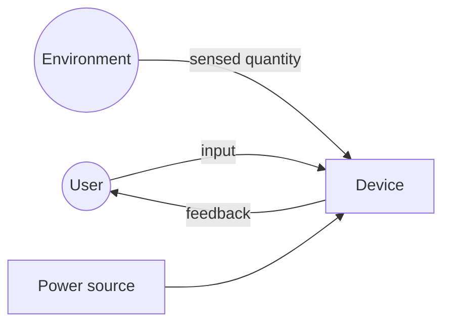

# System design

This document owns the device-level architecture and budgets. Keep implementation
details in their domain artifacts and link to them.

## Context

Replace this with the actual context. Mermaid is preferred because it is text,
diffable, and renderable by common repository viewers.

## Functional blocks

| Block | Responsibility | Candidate implementation | Inputs | Outputs |
| --- | --- | --- | --- | --- |
| Controller | TBD | TBD | TBD | TBD |

## Power path

Document reverse-current behavior, power-source coexistence, off-state behavior,
and which switch truly removes power.

## Power budget

Use worst-case values for capacity and thermal checks; use measured duty-cycle
values for runtime estimates. Every non-measured value needs a source ID.

| Load / mode | Rail (V) | Typical (mA) | Peak (mA) | Duty (%) | Source / measurement | Notes |
| --- | ---: | ---: | ---: | ---: | --- | --- |
| TBD | TBD | TBD | TBD | TBD | SRC-### | TBD |

Derived totals:

- Peak input power: TBD W
- Average input power: TBD W
- Conversion-loss assumption: TBD
- Estimated runtime: TBD h
- Required source margin: TBD

Record calculations in plain equations with units; do not leave unexplained values
inside a spreadsheet or script.

## Data and control flow

Describe timing, update rates, start-up state, failure state, and what happens when
an input or bus is absent.

## Key tradeoffs

| Decision | Options | Chosen | Why | Decision record |
| --- | --- | --- | --- | --- |
| TBD | TBD | TBD | TBD | DEC-### |

## Cross-domain impacts

Link the reviewed contracts in [interfaces.md](interfaces.md), the active risks in
[risks.md](risks.md), and requirement evidence in
[verification.md](verification.md).
